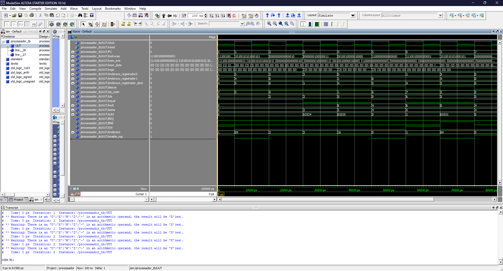
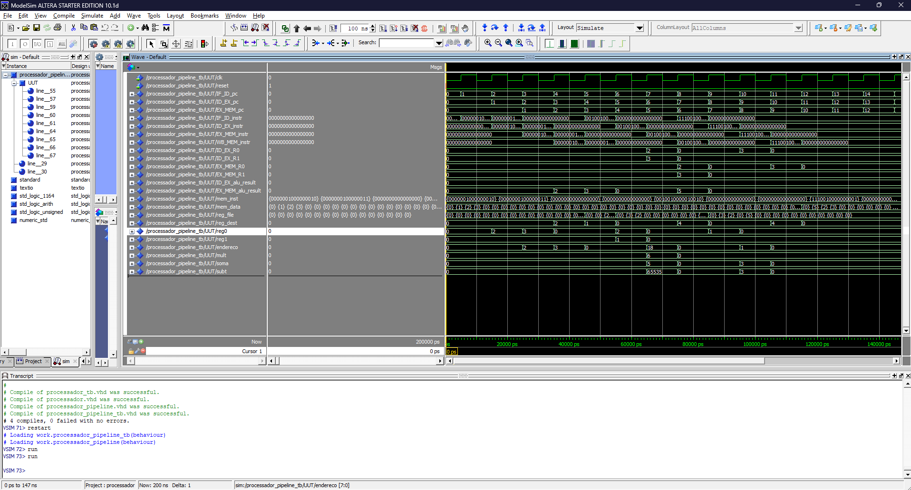

# 🚀 **MIPS Processor - Monocycle and Pipeline Implementation**

Este projeto apresenta duas implementações de um processador **MIPS** em VHDL:

1. **Monociclo**: Cada instrução é executada em um único ciclo de clock.  
2. **Pipeline**: A execução é dividida em estágios, permitindo o processamento simultâneo de múltiplas instruções, aumentando a eficiência.

---

## 📝 **Descrição do Projeto**

O processador possui as seguintes características:

- **Memória de Instruções**: 255 posições.
- **Memória de Dados**: 255 posições.
- **Banco de Registradores**: 16 registradores de 16 bits cada.
- **Instruções**: Suporte para operações básicas como **SW**, **LW**, **ADD**, **SUB**, **MUL**, **BNE**, **BEQ** e **JMP**.

Foram simuladas as execuções de ambos os processadores utilizando o software **ModelSim**, como apresentado nas imagens dos resultados.

---

## 🛠️ **Arquitetura**

### **Monociclo**
- A execução da instrução ocorre em um único ciclo.
- Cada etapa (IF, ID, EX, MEM, WB) é realizada de forma sequencial dentro de um único clock.

**Instruções Testadas:**

| **Instrução** | **Formato**                                    | **Descrição**                           |
|---------------|-----------------------------------------------|----------------------------------------|
| SW            | `111 0 REG(4bits) ENDEREÇO_MEMORIA(8bits)`                         | Armazena um valor do registrador na memória. |
| BNE           | `101 0 DESLOCAMENTO(4bits) REG0(4bits) REG1(4bits)`                      | Salta se os registradores REG0 e REG1 forem diferentes. |
| LW            | `000 0 REG(4bits) ENDEREÇO_MEMORIA(8bits)`                         | Carrega um valor da memória para um registrador. |
| ADD           | `001 0 REG_DEST(4bits) REG0(4bits) REG1(4bits)`                   | Soma dois registradores e armazena o resultado. |
| JMP           | `110 00000 ENDEREÇO_MEMORIA(8bits)`                         | Salta para um endereço especificado. |

---

### **Pipeline**
- A execução é dividida em estágios:
  - **IF**: Busca de instrução.
  - **ID**: Decodificação da instrução.
  - **EX**: Execução (operações da ULA).
  - **MEM**: Acesso à memória.
  - **WB**: Escrita de volta no registrador.
- Múltiplas instruções são processadas simultaneamente em diferentes estágios.

**Instruções Testadas:**

| **Instrução** | **Formato**                                    | **Descrição**                           |
|---------------|-----------------------------------------------|----------------------------------------|
| LW            | `000 0 REG 00000010`                         | Carrega um valor da memória para um registrador. |
| ADD           | `001 0 REG_DEST REG0 REG1`                   | Soma dois registradores e armazena o resultado. |
| SW            | `111 0 REG 00000001`                         | Armazena um valor do registrador na memória. |

---

## 📷 **Resultados da Simulação**

### **Monociclo**
A imagem abaixo mostra a execução das instruções no processador monociclo, onde cada instrução leva um ciclo completo para ser concluída:



### **Pipeline**
A imagem abaixo apresenta o funcionamento do processador pipeline, onde múltiplas instruções são executadas simultaneamente em diferentes estágios:



---

## 🚀 **Como Executar o Projeto**

1. Instale o software **ModelSim** ou qualquer simulador de VHDL compatível.
2. Clone este repositório:
   ```bash
   git clone https://github.com/seu-usuario/mips-processor
   cd mips-processor
